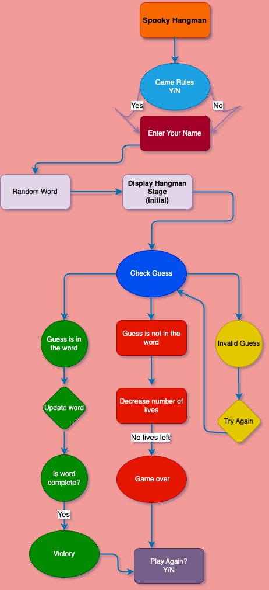
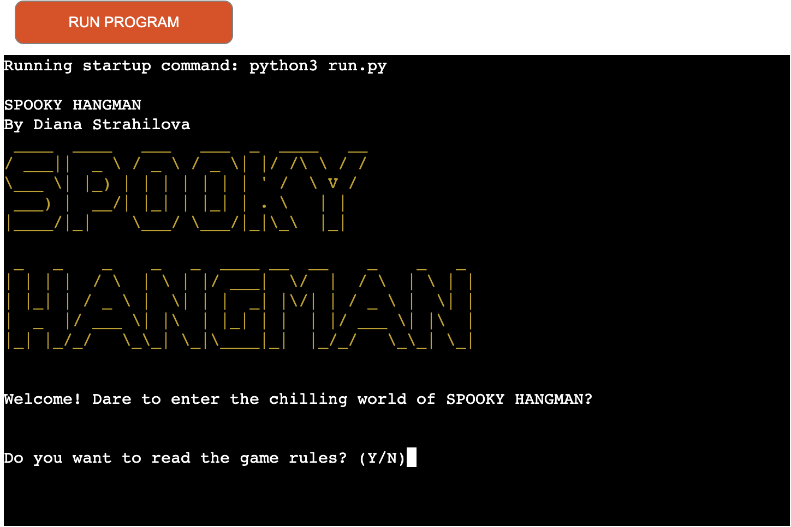
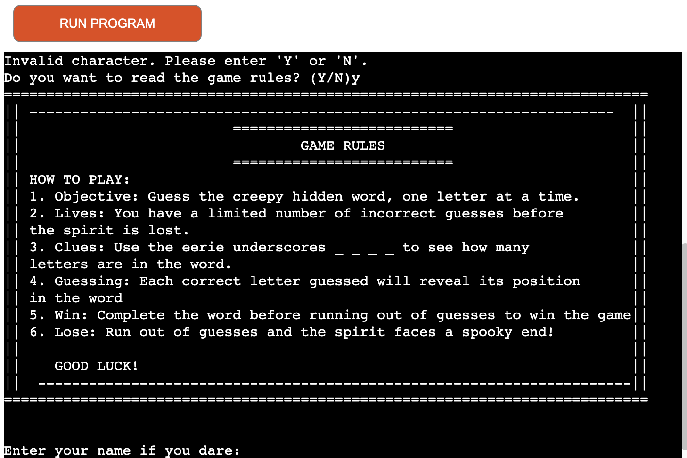
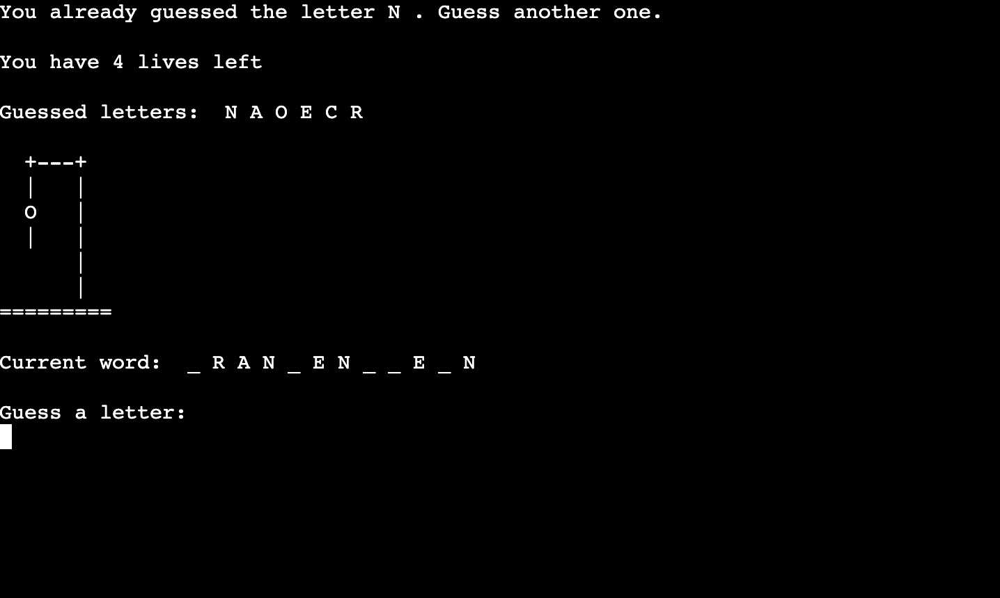

# Spooky Hangman 

This hangman game is an online command line application of the classic word-guessing game Hangman,
which is traditionally played with pen and paper. It is designed to test and train vocabulary and deductive skills
while also having fun.

The word to guess is randomly  generated from a list of spooky words. The number of wrong guesses is limited to the
number of stages it takes to draw the hangman figure. When the hangman figure is complete, the game ends. If the word is guessed before the figure "hangs", the player wins the game.

## Table of contents

- [UX](#UX)
   - [Site Purpose](#site-purpose)
   - [Audience](#audience)
   - [Communication](#communication)
   - [Future Goals](#future-goals)
   
- [Design](#design)
   - [Flowchart](#flowchart)
- [Features](#features)
   - [Landing Page](#landing-page)
   - [Enter Username](#enter-username)
   - [Clear terminal](#clear-terminal)
   - [Possible Outcomes](#possible-outcomes) 
   - [Another Round?](#play-again)
- [Testing](#testing)
   - [Validator Testing](#validator-testing)
   - [Manual Testting](#manual-testing)
   - [Bugs](#bugs)
   - [Remaining Bugs](#remaining-bugs)
- [Technologies Used](#technologies-used)
   - [Main Language](#main-langoage)
   - [Frameworks, Libraries and Programs](#frameworks-libraries-and-programs)
[Deployment](#deployment)
   - [Version Control](#version-control)
   - [Page Deployment](#page-deployment)
- [Credits](#credits)

## UX
### Site Purpose:

To provide a simple and fun platform where the user can try their luck and have fun guessing random words.

### Audience:

Designed for anyone who likes to play games of chanceand looking for a  fun experience.

### Communication:

The game inteface provides clear print statements to guide the users through each choice. The color coded banners add visually appealing element to the game.

### Future Goals:

Make the game more challenging by adding multiple difficulty levels. Make it more appealing by adding more colors and audio.

## Design
     
   ### Flowchart
The flowchart depicts the flow of the game logic:

 

## Features

   ### Landing Page:

 

The landing game displays the game's title, logo, and the developer's name. To add visual appeal the logo is colored in yellow. The greeting lines are animated using the typewriter function, aiming for better user experience.

Game Rules

Players are presented with the choice to read the game rules before starting the game. They can do so by typing "Y" or 'N". If any other input is provided, an invalid choice message will display until providing the correct input.

 

### Enter username

Beneath the rules section, the player is invited to input their name or play as Joker.

### Clear terminal 

This function was added to clear the terminal after player's each guess for better visual experience.

### Possible Outcomes:
   - The letter is in the word
   
   - The letter is not in the word
   
   - Already guessed - will not result in losing a life.
   
   - Any input other than single letter will be considered invalid - will not result in loosing a life.
   

### Play Again:

After the game, regardless of the outcome, a prompt will appear asking if they want to play again. The player can choose to keep playing or quit the game.

## Testing 

### Validator Testing 

-------- img ------

### Manual Testing

--------- img ------

### Bugs

- The logo and game banners were initially a copy/paste IA generated textart. After deploying syntax errors were encountered and it did not look nice (it led to a lot of unnecessary commit messages, while trying to fix it). While trying to resolve this issue, I came across the pyfiglet module and  figlet_format geeksforgeeks. To fix this I installed pyfiglet, imported figlet_format, installed colorama and imported colored - defined the banners as functions and the issue was resolved.

- The Hangman stages also appeared with syntax error after deployment which was resolved by adding a raw string.

### Remaining Bugs

- No bugs remaining as far as I know.

## Technologies Used
### Main Langoage
- Python

### Frameworks, Libraries and Programs

- [GitPod](https://www.gitpod.io/) - as coding environment.
- [GitHub](https://github.com/) - to store the repository for submission.
- [Draw.io](https://app.diagrams.net/) - to create the flowchart.
- [Heroku](https://dashboard.heroku.com/apps) - to deploy the project.
- [Am I Responsive](https://ui.dev/amiresponsive) - the preview image at the top of the README.md.
- [Code Institute template](https://stackoverflow.com/questions/2084508/clear-the-terminal-in-python).
- [Python Linter Validator](https://pep8ci.herokuapp.com/)

## Deployment
   ### Version Control 

   The version control was maintained using git within GitPod VS Code workspace and push code to main repository.
   - From the VS Code terminal type "git add .", to make changes/upadates to the files.
   - Type "git commit -m (insert a short message)", which commits the changes and updates the files.
   - Use "git push" command to push the commited changes to the main repository.

   ### Page Deployment

   The app was deployed to Heroku CLI. The steps are as follows:
   - After creating an account and signing in, click "New" to create a new app from the dashboard.
   - Create a unique name for the app and select region; press "Create app".
   - Go to "Settings" to navigate to "Config Vars."
   - Add Config Vars.
        - For this app was used: "KEY = PORT : VALUE = 8000". As stated in the README.md template for this project. 
   - Add buildpacks Python and NodeJS.
   - Click "Deploy Branch".
   - Scroll down to Deployment Method and select GitHub.
   - Select the repository to be deployed and connect to Heroku.
   - Scroll down to "Deploy":
        - Option 1 is selectiong Automatic Deploys.
        - Option 2 is Manual Deploys, which was used for this project.
   - Live deployment [Spooky Hangman](https://spooky-hangman-b6ee3e9202ec.herokuapp.com/)

## Credits 

As an inspiration, I watched the following YouTube tutorials:

- [Kite](https://www.youtube.com/watch?v=m4nEnsavl6w&t=93s)
- [Shaun Halverson](https://www.youtube.com/watch?v=pFvSb7cb_Us)
- [CBT Nuggets](https://www.youtube.com/watch?v=JNXmCOumNw0&t=452s)
- [Kylie Ying](https://www.youtube.com/watch?v=cJJTnI22IF8)

Also the following articles were consulted throughout the project:

- [Python For Beginners](https://www.pythonforbeginners.com/code-snippets-source-code/game-hangman) - to understand the logic.
- [Geeks For Geeks](https://www.geeksforgeeks.org/python-ascii-art-using-pyfiglet-module/) - to learn how to create ASCII art using pyfiglet and figlet_format.
- [Stack Overflow](https://stackoverflow.com/questions/20302331/typing-effect-in-python) - to learn  how to create typewriter effect to the text. 
   - And [Clear Terminal](https://stackoverflow.com/questions/2084508/clear-the-terminal-in-python) - how to clear the terminal.
- [Set()Function](https://www.programiz.com/python-programming/methods/built-in/set) - to return the guessed letters.
- [Pypi](https://pypi.org/project/termcolor/) - to isntall and learn how to use termcolor and colored.

## Acknowledgments

A special a aknowledgment to my mentor Martina Terlevic - for her guidance, support and valuable advice.

